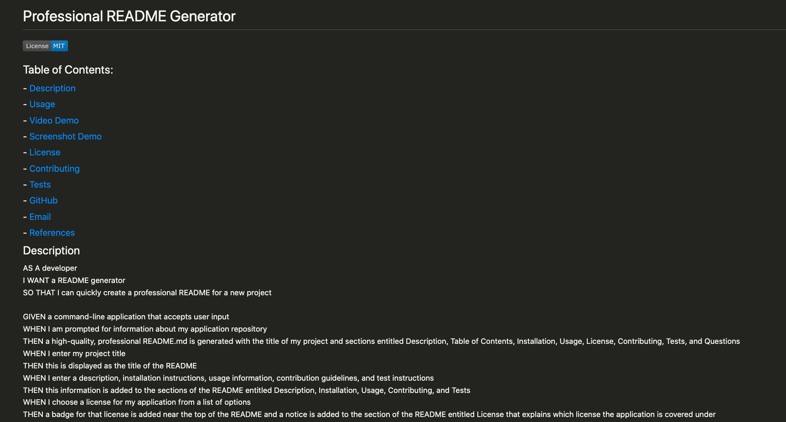

# Professional README Generator

## Table of Contents:
### - [Description](#description)
### - [Usage](#usage)
### - [Video Demo](#video)
### - [Screenshot Demo](#screenshot)
### - [License](#license)
### - [Contributing](#contributing)
### - [Tests](#tests)
### - [Questions](#questions)
### - [References](#references)

## Description
AS A developer I WANT a README generator SO THAT I can quickly create a professional README for a new project  GIVEN a command-line application that accepts user input WHEN I am prompted for information about my application repository THEN a high-quality, professional README.md is generated with the title of my project and sections entitled Description, Table of Contents, Installation, Usage, License, Contributing, Tests, and Questions WHEN I enter my project title THEN this is displayed as the title of the README WHEN I enter a description, installation instructions, usage information, contribution guidelines, and test instructions THEN this information is added to the sections of the README entitled Description, Installation, Usage, Contributing, and Tests WHEN I choose a license for my application from a list of options THEN a badge for that license is added near the top of the README and a notice is added to the section of the README entitled License that explains which license the application is covered under WHEN I enter my GitHub username THEN this is added to the section of the README entitled Questions, with a link to my GitHub profile WHEN I enter my email address THEN this is added to the section of the README entitled Questions, with instructions on how to reach me with additional questions WHEN I click on the links in the Table of Contents THEN I am taken to the corresponding section of the README

## Installation
Install the Dev folder and run index.js in the integrated terminal

## Usage
This Professional README Generator uses the Node.js file system (fs) module to work with the file system in the computer and the Inquirer NPM package to provide a way to capture inputs in Node.js from the integrated terminal by prompting questions and returning the answers given by the user.  It also enables the user to embed a remotely hosted video, attach images and link web references or attributes into the README documentation.

## Demo Video

## Demo Screenshot

## License
Three license choices namely MIT, Apache 2.0 and GNU GPL v3 are made available and a foourth choice with None if the user prefer not to make a choice of the available license choices  When a license type is chosen a badge will be included below the title, when none is chosen, line below the title will be empty.
- MIT

## Contributing
Thank you for investing your time in contributing to Professional README Generator project!  In this guide you will get an overview of the contribution workflow from creating a pull request, reviewing and merging the pull request.  <b>Making the changes locally</b> 1. Fork the repository 2. Install or update Node.js 8.2.4 3. Create a working branch and start with your changes!  <b>Commit your update</b> Commit the changes once you are happy with them.  Don't forget to self-review to speed up the review process.  <b>Pull Request</b> When you are finished with the changes, create a pull request  <b>Merging your Pull Request</b> 1. Our team will review your Pull Request. 2. We may ask for changes to be made before your Pull Request can be merged. 3. You can apply suggested changes directly through the UI.  You can make any other changes on your fork, then commit them on your branch. 4. As you update your PR and apply changes, mark each conversation as resolved. 5. You can then merge your contributions.  Thank you for your contribution.

## Tests
Challenge09 Readme is tested and generated using this Profesisonal README Generator, the original readme test file is named sampleREADME.mdto prevent it being overwritten by a new user.  Testing is carried out with the following sequence: 1. blank input to test validation prompt (Only title blank input will be tested) 2. Input title 3. Input description 4. Input installation 5. Input usage 6. Input video link 7. Input image link 8. Choose license 9. Input contributing guidelines 10. Input testing procedures 11. Input github username 12. Input email address 13. Input References

## Questions
If you have any questions, please contact me:
- GitHub: [peterwonghg](https://github.com/peterwonghg)
- Email: peterwonghg@gmail.com

## References
Creating a Professional README Generator – Sam Meske https://www.youtube.com/watch?v=xMoAZVIiGT0  README.md Generator with Node.js and inquirer https://www.youtube.com/watch?v=SpFyvDPdcO0  How to embed a video inro GitHub README.ms? https://stackoverflow.com/questions/4279611/how-to-embed-a-video-into-github-readme-md  npm inquirer.js Documentation https://www.npmjs.com/package/inquirer#prompt  Welcome to GitHub docs contributing guide https://github.com/github/docs/blob/main/CONTRIBUTING.md

